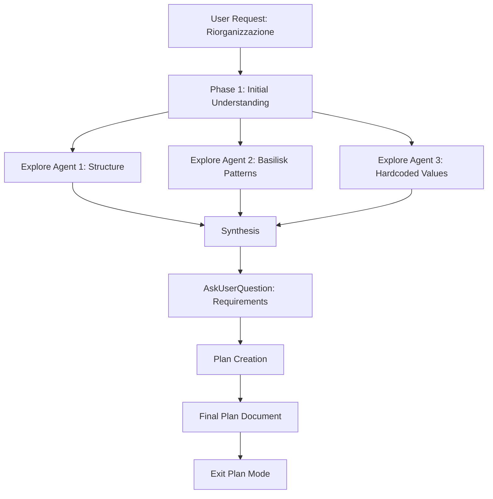

# Piano di Ristrutturazione Completa - Progetto EXCITE AOCS

## Obiettivo
Ristrutturare il progetto EXCITE secondo best practices per applicazioni scientifiche Python/C, mantenendo compatibilità con framework Basilisk, con focus su:
- Struttura modulare professionale
- Build system dedicato per moduli C
- Separazione configuration/code
- Packaging Python corretto
- Documentazione completa

## Requisiti Utente
- ✅ Ristrutturazione completa (config files, packages separati)
- ✅ Build system dedicato (CMake/setuptools) per C modules
- ⚠️ NO config multiple (EXCITE hardcoded)
- ⚠️ NO test suite automation (solo simulazioni manuali)

## Struttura Target Proposta

```
excite_aocs/
├── README.md                          # Documentazione principale (aggiornata)
├── CLAUDE.md                          # Guida per Claude Code
├── LICENSE                            # Licenza progetto
├── pyproject.toml                     # Build config moderna (PEP 517/518)
├── setup.py                           # Fallback per compatibilità
├── CMakeLists.txt                     # Build config moduli C
├── requirements.txt                   # Dipendenze Python
├── requirements-dev.txt               # Dipendenze sviluppo
├── .gitignore                         # Ignore patterns
├── .editorconfig                      # Code style consistency
│
├── excite/                            # Package Python principale
│   ├── __init__.py                    # Package marker + versione
│   ├── __main__.py                    # Entry point: python -m excite
│   │
│   ├── config/                        # Modulo configurazione
│   │   ├── __init__.py
│   │   ├── spacecraft.py              # Parametri spacecraft (massa, inerzia, geometry)
│   │   ├── sensors.py                 # Parametri sensori (ST, IMU, TAM, CSS)
│   │   ├── actuators.py               # Parametri attuatori (RW, MTB, thruster)
│   │   ├── environment.py             # Parametri ambiente (gravità, atmosfera, SRP)
│   │   ├── mission.py                 # Parametri missione (timeline, FSM states)
│   │   ├── control.py                 # Guadagni controllori (MRP, Rate Servo, B-dot)
│   │   └── constants.py               # Costanti fisiche e conversioni
│   │
│   ├── dynamics/                      # Moduli dinamica
│   │   ├── __init__.py
│   │   ├── spacecraft_model.py        # BSKDynamicModels (rinominato)
│   │   ├── gravity.py                 # Setup gravity bodies
│   │   ├── actuators.py               # Setup RW, MTB, thruster
│   │   ├── sensors.py                 # Setup ST, IMU, TAM, CSS
│   │   ├── environment.py             # Setup atmosfera, SRP, mag field
│   │   └── power.py                   # Setup batteria, pannelli solari
│   │
│   ├── fsw/                           # Flight Software
│   │   ├── __init__.py
│   │   ├── fsw_model.py               # BSKFswModels (rinominato)
│   │   ├── navigation/                # Sottopacchetto navigazione
│   │   │   ├── __init__.py
│   │   │   ├── quest.py               # Setup QUEST module
│   │   │   └── smekf.py               # Setup SMEKF module
│   │   ├── guidance/                  # Sottopacchetto guida
│   │   │   ├── __init__.py
│   │   │   ├── sun_safe.py            # Sun-safe pointing
│   │   │   ├── gs_pointing.py         # Ground station pointing
│   │   │   └── nadir.py               # Nadir pointing
│   │   ├── control/                   # Sottopacchetto controllo
│   │   │   ├── __init__.py
│   │   │   ├── mrp_steering.py        # MRP steering setup
│   │   │   ├── rate_servo.py          # Rate servo setup
│   │   │   ├── bdot.py                # B-dot controller
│   │   │   └── momentum_mgmt.py       # RW desaturation
│   │   └── fsm/                       # Finite State Machine
│   │       ├── __init__.py
│   │       ├── events.py              # FSM event definitions
│   │       └── states.py              # FSM state handlers
│   │
│   ├── scenario/                      # Scenario execution
│   │   ├── __init__.py
│   │   ├── scenario.py                # scenario_EXCITE class (rinominato)
│   │   ├── initial_conditions.py      # Setup condizioni iniziali
│   │   └── logging.py                 # Message logging config
│   │
│   ├── analysis/                      # Post-processing e analisi
│   │   ├── __init__.py
│   │   ├── plotting.py                # EXCITE_Plotting (rinominato)
│   │   ├── metrics.py                 # Calcolo metriche performance
│   │   └── reports.py                 # Generazione report
│   │
│   └── utils/                         # Utility generali
│       ├── __init__.py
│       ├── paths.py                   # Path management (Basilisk data, SPICE)
│       ├── conversions.py             # Conversioni unità
│       └── validators.py              # Validazione parametri
│
├── excite_c_modules/                  # Moduli C custom
│   ├── CMakeLists.txt                 # Build configuration
│   ├── include/                       # Header files
│   │   ├── smekf.h                    # SMEKF header (se esiste)
│   │   └── quest_att_det.h            # QUEST header (se esiste)
│   ├── src/                           # Implementazioni C
│   │   ├── SMEKF.c                    # SMEKF implementation
│   │   └── questAttDet.c              # QUEST implementation
│   └── setup.py                       # Build script per moduli C
│
├── scripts/                           # Script eseguibili
│   ├── run_simulation.py              # Main entry point
│   ├── plot_results.py                # Post-processing standalone
│   └── validate_config.py             # Validazione configurazione
│
├── docs/                              # Documentazione
│   ├── README.md                      # Guida documentazione
│   ├── architecture.md                # Architettura sistema
│   ├── mission_phases.md              # Descrizione fasi missione
│   ├── algorithms/                    # Algoritmi tecnici
│   │   ├── quest.md                   # Algoritmo QUEST
│   │   ├── smekf.md                   # Algoritmo SMEKF
│   │   └── control.md                 # Leggi di controllo
│   ├── hardware/                      # Specifiche hardware
│   │   ├── spacecraft.md              # Parametri satellite
│   │   ├── sensors.md                 # Sensori
│   │   └── actuators.md               # Attuatori
│   └── images/                        # Diagrammi e immagini
│
├── examples/                          # Esempi uso
│   ├── basic_simulation.py            # Simulazione base
│   ├── custom_initial_conditions.py   # Esempio modifiche IC
│   └── parameter_sweep.py             # Sweep parametri controllo
│
└── data/                              # Dati di output (non versionati)
    ├── plots/                         # Grafici generati
    └── telemetry/                     # Dati telemetrici
```

## Fase 1: Preparazione Struttura Base

### 1.1 Creazione Struttura Directory
```bash
# Creare tutte le directory necessarie
mkdir -p excite/{config,dynamics,fsw/{navigation,guidance,control,fsm},scenario,analysis,utils}
mkdir -p excite_c_modules/{include,src}
mkdir -p scripts docs/{algorithms,hardware,images} examples data/{plots,telemetry}
```

### 1.2 File di Configurazione Build

**pyproject.toml** (PEP 517/518 compliant):
```toml
[build-system]
requires = ["setuptools>=61.0", "wheel", "cmake>=3.18"]
build-backend = "setuptools.build_meta"

[project]
name = "excite-aocs"
version = "1.0.0"
description = "EXCITE CubeSat 12U AOCS Simulation using Basilisk"
authors = [{name = "Your Name", email = "your.email@example.com"}]
license = {text = "MIT"}
readme = "README.md"
requires-python = ">=3.8"
classifiers = [
    "Programming Language :: Python :: 3",
    "Programming Language :: C",
    "Topic :: Scientific/Engineering :: Physics",
    "Topic :: Scientific/Engineering :: Astronomy"
]
dependencies = [
    "numpy>=1.20",
    "matplotlib>=3.3",
    "basilisk-framework>=2.0"
]

[project.optional-dependencies]
dev = [
    "pytest>=7.0",
    "black>=22.0",
    "flake8>=4.0",
    "mypy>=0.950"
]

[project.scripts]
excite-sim = "excite.__main__:main"

[tool.setuptools.packages.find]
where = ["."]
include = ["excite*"]
exclude = ["excite_c_modules*"]
```

**CMakeLists.txt** (root):
```cmake
cmake_minimum_required(VERSION 3.18)
project(excite_c_modules C)

set(CMAKE_C_STANDARD 11)
set(CMAKE_C_STANDARD_REQUIRED ON)

# Find Basilisk
find_package(Basilisk REQUIRED)

add_subdirectory(excite_c_modules)
```

**excite_c_modules/CMakeLists.txt**:
```cmake
# SMEKF Module
add_library(SMEKF MODULE src/SMEKF.c)
target_include_directories(SMEKF PRIVATE include ${Basilisk_INCLUDE_DIRS})
target_link_libraries(SMEKF PRIVATE ${Basilisk_LIBRARIES})
set_target_properties(SMEKF PROPERTIES PREFIX "")

# QUEST Module
add_library(questAttDet MODULE src/questAttDet.c)
target_include_directories(questAttDet PRIVATE include ${Basilisk_INCLUDE_DIRS})
target_link_libraries(questAttDet PRIVATE ${Basilisk_LIBRARIES})
set_target_properties(questAttDet PROPERTIES PREFIX "")

# Install targets
install(TARGETS SMEKF questAttDet LIBRARY DESTINATION ${Python_SITEARCH}/excite)
```

## Fase 2: Migrazione Codice Python

### 2.1 Estrazione Configurazioni Hardcoded

**excite/config/spacecraft.py**:
```python
"""Parametri configurazione spacecraft EXCITE"""
import numpy as np

# Massa e inerzia
TOTAL_MASS_KG = 14.0  # kg - massa totale satellite
INERTIA_TENSOR_KG_M2 = np.array([
    [0.1, 0.0, 0.0],
    [0.0, 0.15, 0.0],
    [0.0, 0.0, 0.12]
])  # kg*m^2 - tensore d'inerzia

# Geometria
SPACECRAFT_DIMENSIONS_M = {
    'length': 0.34,  # m - 3U lungo asse X
    'width': 0.10,   # m - 1U asse Y
    'height': 0.10   # m - 1U asse Z
}

# Proprietà superficie per drag/SRP
DRAG_COEFFICIENT = 2.2
SRP_REFLECTIVITY = 0.9  # Pannelli solari
MAGNETIC_DIPOLE_AM2 = np.array([0.035, 0.035, 0.02])  # A*m^2

# Pannelli solari
NUM_SOLAR_PANELS = 4
PANEL_AREA_M2 = 0.03  # m^2 per pannello
PANEL_EFFICIENCY = 0.29
PANEL_NORMAL_VECTORS = [
    np.array([1, 0, 0]),   # Panel 1: +X
    np.array([-1, 0, 0]),  # Panel 2: -X
    np.array([0, 1, 0]),   # Panel 3: +Y
    np.array([0, -1, 0])   # Panel 4: -Y
]
```

**excite/config/actuators.py**:
```python
"""Parametri attuatori EXCITE"""
import numpy as np
from Basilisk.utilities import macros

# Reaction Wheels (CubeSpace CW0162) - Configurazione piramidale
NUM_RW = 4
RW_PYRAMID_ELEVATION_DEG = 26.57  # gradi
RW_PYRAMID_AZIMUTHS_DEG = [45.0, 135.0, 225.0, 315.0]  # gradi

RW_MAX_TORQUE_NM = 0.2  # N*m - coppia massima
RW_MAX_SPEED_RPM = 6000  # RPM
RW_INERTIA_KG_M2 = 5.0e-6  # kg*m^2

# Magnetorquers (MTB)
NUM_MTB = 3
MTB_MAX_DIPOLE_AM2 = 0.8  # A*m^2 - dipolo massimo per asse
MTB_AXES = np.eye(3)  # MTB allineati con assi body

# Thruster chimico H2O2 (UniPi IOD)
THRUSTER_MAX_THRUST_N = 1.0  # N
THRUSTER_ISP_S = 180  # s - impulso specifico
THRUSTER_LOCATION_M = np.array([0.0, 0.0, -0.15])  # m - posizione in body frame
THRUSTER_DIRECTION = np.array([0.0, 0.0, 1.0])  # direzione thrust (+Z)
```

**excite/config/mission.py**:
```python
"""Parametri missione e timeline EXCITE"""
from Basilisk.utilities import macros

# Parametri orbitali
ORBITAL_ELEMENTS = {
    'semi_major_axis_m': 6878.137e3,  # m - 500 km altitude
    'eccentricity': 0.01,
    'inclination_deg': 97.99,  # deg - sun-synchronous
    'raan_deg': 70.0,  # deg - ottimizzato per Pisa
    'argument_periapsis_deg': 0.0,
    'true_anomaly_deg': 0.0
}

# Condizioni iniziali assetto
INITIAL_ATTITUDE_MRP = [0.0, 0.2, -0.3]  # MRP parameters
INITIAL_ANGULAR_VELOCITY_RAD_S = [0.4, -0.4, 0.5]  # rad/s

# Timeline missione (24 ore)
MISSION_DURATION_HOURS = 24.0
DETUMBLING_MAX_DURATION_HOURS = 12.0  # timeout backup
DEPLOYMENT_DURATION_S = 60.0  # secondi per deployment pannelli
POST_DEPLOYMENT_WAIT_HOURS = 1.0  # attesa stabilizzazione

# Soglie transizioni FSM
DETUMBLING_COMPLETE_THRESHOLD_RAD_S = 1e-2  # rad/s - omega norm
ECLIPSE_SHADOW_THRESHOLD = 0.1  # 0.0-1.0 (0=eclissi totale)

# Ground Station (Pisa)
GS_LOCATION = {
    'name': 'PisaGroundStation',
    'latitude_deg': 43.7,  # gradi
    'longitude_deg': 10.4,  # gradi
    'altitude_m': 0.0  # m
}
GS_MIN_ELEVATION_DEG = 10.0  # gradi - elevazione minima per contatto
```

**excite/config/control.py**:
```python
"""Guadagni controllori e parametri tuning"""

# MRP Steering (Outer Loop)
MRP_STEERING_K1 = 0.15  # Guadagno proporzionale
MRP_STEERING_K3 = 1.0   # Guadagno derivativo
MRP_STEERING_OMEGA_MAX_RAD_S = 0.05  # rad/s - limite velocità angolare

# Rate Servo (Inner Loop)
RATE_SERVO_K = 5.0  # Guadagno controllo
RATE_SERVO_Ki = 0.05  # Integrale (anti-windup)
RATE_SERVO_P = 150.0  # Matrice P

# B-dot Controller
BDOT_GAIN = -3e5  # Guadagno B-dot [A*m^2/T/s]

# Momentum Management
RW_DESATURATION_THRESHOLD_NMS = 5.0  # N*m*s - threshold momentum
MTB_DESATURATION_GAIN = 1e-4  # Guadagno desaturazione

# Low-pass Filter (Torque Command)
TORQUE_FILTER_OMEGA_C_RAD_S = 2.0 * 3.14159 * 0.01  # rad/s - cutoff freq
```

### 2.2 Refactoring Moduli Principali

**excite/dynamics/spacecraft_model.py** (da EXCITE_Dynamics.py):
- Spostare class `BSKDynamicModels` → `SpacecraftDynamicsModel`
- Importare config da `excite.config.*`
- Suddividere metodi `InitAllDynObjects()` in chiamate modulari
- Ogni sottosistema (gravity, sensors, actuators) → metodo separato

**excite/fsw/fsw_model.py** (da EXCITE_Fsw.py):
- Spostare class `BSKFswModels` → `FlightSoftwareModel`
- Importare config da `excite.config.*`
- Suddividere setup in sottopacchetti (navigation/, guidance/, control/, fsm/)

**excite/scenario/scenario.py** (da EXCITE_scenario.py):
- Spostare class `scenario_EXCITE` → `ExciteScenario`
- Metodi helper → `initial_conditions.py` e `logging.py`
- Mantenere compatibilità con BSKSim/BSKScenario

### 2.3 Creazione Package __init__.py

**excite/__init__.py**:
```python
"""EXCITE AOCS Simulation Package"""
__version__ = "1.0.0"

from .scenario.scenario import ExciteScenario
from .dynamics.spacecraft_model import SpacecraftDynamicsModel
from .fsw.fsw_model import FlightSoftwareModel

__all__ = [
    'ExciteScenario',
    'SpacecraftDynamicsModel',
    'FlightSoftwareModel'
]
```

**excite/__main__.py**:
```python
"""Entry point for running EXCITE simulation"""
import sys
from excite.scenario.scenario import ExciteScenario

def main():
    """Run EXCITE 24-hour mission simulation"""
    print("Starting EXCITE AOCS Simulation...")

    scenario = ExciteScenario()
    scenario.run_simulation(show_plots=True)

    print("Simulation complete.")
    return 0

if __name__ == "__main__":
    sys.exit(main())
```

## Fase 3: Migrazione Moduli C

### 3.1 Organizzazione Header Files

**excite_c_modules/include/smekf.h**:
- Estrarre header da SMEKF.c se presente in Basilisk
- Altrimenti creare header minimo con dichiarazioni funzioni

**excite_c_modules/include/quest_att_det.h**:
- Analogo per QUEST

### 3.2 Build System Setup

**excite_c_modules/setup.py**:
```python
"""Build script per moduli C custom"""
import os
import sys
from setuptools import setup, Extension
from setuptools.command.build_ext import build_ext
import subprocess

class CMakeExtension(Extension):
    def __init__(self, name, sourcedir=''):
        Extension.__init__(self, name, sources=[])
        self.sourcedir = os.path.abspath(sourcedir)

class CMakeBuild(build_ext):
    def build_extension(self, ext):
        # Esegue CMake build
        # ... (implementazione standard CMake + setuptools)
        pass

setup(
    name='excite-c-modules',
    version='1.0.0',
    ext_modules=[CMakeExtension('excite_c_modules')],
    cmdclass={'build_ext': CMakeBuild}
)
```

## Fase 4: Script Eseguibili

**scripts/run_simulation.py**:
```python
#!/usr/bin/env python3
"""Main script per eseguire simulazione EXCITE"""
import argparse
from excite.scenario.scenario import ExciteScenario

def main():
    parser = argparse.ArgumentParser(description='Run EXCITE AOCS Simulation')
    parser.add_argument('--plots', action='store_true', help='Show plots')
    parser.add_argument('--duration', type=float, default=24.0,
                       help='Simulation duration (hours)')
    args = parser.parse_args()

    scenario = ExciteScenario()
    scenario.run_simulation(
        duration_hours=args.duration,
        show_plots=args.plots
    )

if __name__ == '__main__':
    main()
```

## Fase 5: Documentazione

### 5.1 README.md Aggiornato

Struttura:
```markdown
# EXCITE Satellite AOCS Simulation

## Overview
[Descrizione progetto]

## Features
[Caratteristiche chiave]

## Installation

### Prerequisites
- Python 3.8+
- Basilisk Framework
- CMake 3.18+
- C compiler (gcc/clang)

### Install from source
```bash
git clone <repo>
cd umb_v2
pip install -e .
```

### Build C modules
```bash
cd excite_c_modules
mkdir build && cd build
cmake ..
make
sudo make install
```

## Quick Start
```bash
# Run simulation
python -m excite

# Or use script
python scripts/run_simulation.py --plots
```

## Architecture
[Link a docs/architecture.md]

## Configuration
[Descrizione struttura config/]

## Mission Phases
[Descrizione 7 fasi]

## Usage Guide
[Link a docs/usage_guide.md]

## Development
[Setup development environment]

## Contributing
[Guidelines]

## License
MIT
```

### 5.2 Documentazione Tecnica

**docs/architecture.md**:
- Diagramma architettura generale
- Message-passing flow
- FSM states diagram
- Control loops diagram

**docs/mission_phases.md**:
- Dettaglio 7 fasi con grafici
- Trigger conditions
- Expected behavior

**docs/algorithms/quest.md**:
- Teoria algoritmo QUEST
- Wahba's problem
- Implementation details
- Tuning guidelines

**docs/algorithms/smekf.md**:
- SMEKF theory
- State vector structure
- Propagation/update steps
- Tuning guidelines

### 5.3 Guida d'Utilizzo Completa

**docs/usage_guide.md**:
```markdown
# Guida d'Utilizzo EXCITE AOCS Simulation

Questa guida fornisce istruzioni complete per utilizzare il simulatore EXCITE AOCS.

## Indice
1. [Esecuzione Base](#esecuzione-base)
2. [Configurazione Parametri](#configurazione-parametri)
3. [Analisi Risultati](#analisi-risultati)
4. [Workflow Tipici](#workflow-tipici)
5. [Troubleshooting](#troubleshooting)

---

## 1. Esecuzione Base

### 1.1 Simulazione Standard (24 ore)

**Metodo 1: Entry point Python module**
```bash
# Dalla root del progetto
python -m excite
```
Questo esegue la simulazione completa di 24 ore con le impostazioni di default.

**Metodo 2: Script dedicato**
```bash
python scripts/run_simulation.py --plots
```

Opzioni disponibili:
- `--plots`: Mostra grafici al termine della simulazione
- `--duration HOURS`: Imposta durata simulazione (default: 24.0 ore)
- `--no-plots`: Esegue senza visualizzazione grafici (utile per batch runs)

**Esempio: Simulazione breve per test**
```bash
python scripts/run_simulation.py --duration 2.0 --plots
```
Esegue solo 2 ore di missione per test rapidi.

### 1.2 Esecuzione da Python Interattivo

```python
from excite.scenario.scenario import ExciteScenario

# Crea scenario
scenario = ExciteScenario()

# Esegui simulazione
scenario.run_simulation(duration_hours=24.0, show_plots=True)
```

### 1.3 Output della Simulazione

Durante l'esecuzione, vedrai:
```
Starting EXCITE AOCS Simulation...
[BSK_INFORMATION] Initializing spacecraft dynamics...
[BSK_INFORMATION] Setting up actuators (RW, MTB, Thruster)...
[BSK_INFORMATION] Setting up sensors (ST, IMU, TAM, CSS)...
[BSK_INFORMATION] Initializing Flight Software...
[BSK_INFORMATION] Setting up navigation (QUEST, SMEKF)...
[BSK_INFORMATION] Setting up guidance (Sun-Safe, GS-Pointing, Nadir)...
[BSK_INFORMATION] Setting up control (MRP-Steering, Rate-Servo, B-dot)...

Mission Timeline:
Phase 1: Deployment (0.0 - 0.017 h)
Phase 2: Detumbling (0.017 - 12.0 h max)
Phase 3: Sun-Safe (post detumbling)
Phase 4: Initial Charge (1 hour)
Phase 5: Payload A (Earth-facing, 2 hours)
Phase 6: Payload B (Nadir-pointing, 1.5 hours)
Phase 7: GS Contact (Pisa station pointing)

Simulation Progress: [=========>      ] 45% | 10.8 / 24.0 hours
...
Simulation complete.
```

Al termine, i risultati sono salvati in:
- `data/telemetry/excite_run_YYYYMMDD_HHMMSS.csv` - Dati telemetrici
- `data/plots/` - Grafici (se abilitati)

---

## 2. Configurazione Parametri

### 2.1 Struttura Configurazioni

Tutti i parametri sono centralizzati in `excite/config/`:

```
excite/config/
├── spacecraft.py      # Massa, inerzia, geometria
├── actuators.py       # RW, MTB, Thruster specs
├── sensors.py         # Star Tracker, IMU, TAM, CSS
├── mission.py         # Orbita, timeline, IC assetto
├── control.py         # Guadagni controllori
├── environment.py     # Gravità, atmosfera, SRP
└── constants.py       # Costanti fisiche
```

### 2.2 Modifica Parametri Spacecraft

**File: `excite/config/spacecraft.py`**

```python
# Esempio: Modificare massa satellite
TOTAL_MASS_KG = 15.0  # Cambiato da 14.0 a 15.0 kg

# Esempio: Modificare tensore inerzia
INERTIA_TENSOR_KG_M2 = np.array([
    [0.12, 0.0, 0.0],   # Aumentato Ixx
    [0.0, 0.18, 0.0],   # Aumentato Iyy
    [0.0, 0.0, 0.14]    # Aumentato Izz
])
```

**Quando modificare:**
- Cambio configurazione payload
- Aggiornamento design strutturale
- Calibrazione post-test hardware

### 2.3 Tuning Controllori

**File: `excite/config/control.py`**

```python
# MRP Steering (Outer Loop)
MRP_STEERING_K1 = 0.20  # ↑ Aumenta per tracking più aggressivo
MRP_STEERING_K3 = 1.2   # ↑ Aumenta per smorzamento maggiore
MRP_STEERING_OMEGA_MAX_RAD_S = 0.08  # ↑ Permette velocità maggiori

# Rate Servo (Inner Loop)
RATE_SERVO_K = 7.0  # ↑ Aumenta per risposta più rapida
RATE_SERVO_Ki = 0.08  # ↑ Aumenta per ridurre steady-state error

# B-dot Controller
BDOT_GAIN = -4e5  # ↑ Aumenta magnitudine per detumbling più rapido
```

**Linee guida tuning:**
1. **Troppo oscillatorio?** → Riduci K1, aumenta K3
2. **Tracking lento?** → Aumenta K1 e RATE_SERVO_K
3. **Detumbling inefficace?** → Aumenta BDOT_GAIN (magnitudine)
4. **Overshoot eccessivo?** → Riduci OMEGA_MAX

### 2.4 Modifica Timeline Missione

**File: `excite/config/mission.py`**

```python
# Esempio: Missione più lunga
MISSION_DURATION_HOURS = 48.0  # Cambiato da 24 a 48 ore

# Esempio: Timeout detumbling più breve
DETUMBLING_MAX_DURATION_HOURS = 8.0  # Cambiato da 12 a 8 ore

# Esempio: Soglia detumbling più rigida
DETUMBLING_COMPLETE_THRESHOLD_RAD_S = 5e-3  # Da 1e-2 a 5e-3 rad/s
```

### 2.5 Configurazione Orbita

**File: `excite/config/mission.py`**

```python
ORBITAL_ELEMENTS = {
    'semi_major_axis_m': 6878.137e3,  # 500 km altitude
    'eccentricity': 0.005,  # Orbita quasi circolare
    'inclination_deg': 98.0,  # Sun-synchronous
    'raan_deg': 70.0,  # Ottimizzato per Pisa
    'argument_periapsis_deg': 0.0,
    'true_anomaly_deg': 0.0
}
```

**Orbite comuni:**
- **LEO 500 km SSO**: `semi_major = 6878.137e3`, `inc = 97.99°`
- **LEO 600 km**: `semi_major = 6978.137e3`
- **ISS-like**: `semi_major = 6778.137e3`, `inc = 51.6°`

---

## 3. Analisi Risultati

### 3.1 Grafici Automatici

Dopo `run_simulation.py --plots`, vengono generati:

**Plot 1: Attitude Error (MRP)**
- X-axis: Tempo (ore)
- Y-axis: MRP components [σ1, σ2, σ3]
- **Cosa cercare:**
  - Convergenza a ~0 dopo detumbling
  - Oscillazioni controllate durante pointing
  - No divergenza (|σ| < 1)

**Plot 2: Angular Velocity**
- X-axis: Tempo (ore)
- Y-axis: ω [rad/s] in body frame
- **Cosa cercare:**
  - Riduzione da ~0.4 rad/s iniziale a < 0.01 rad/s
  - Stabilità durante fasi operative
  - Picchi durante slew maneuvers

**Plot 3: RW Speeds**
- X-axis: Tempo (ore)
- Y-axis: RPM per 4 ruote
- **Cosa cercare:**
  - Crescita durante detumbling
  - Oscillazioni durante pointing
  - Desaturazione efficace (no saturazione a 6000 RPM)

**Plot 4: Control Torques**
- X-axis: Tempo (ore)
- Y-axis: Torque [N*m] per asse
- **Cosa cercare:**
  - Picchi iniziali (detumbling)
  - Riduzione in steady-state
  - Limiti rispettati (< 0.2 N*m)

**Plot 5: Power & Battery**
- X-axis: Tempo (ore)
- Y-axis: Battery charge [%], Solar power [W]
- **Cosa cercare:**
  - Cicli carica/scarica in eclissi
  - Bilancio energetico positivo
  - No undervoltage events

### 3.2 Analisi Telemetria Custom

```python
from excite.analysis.plotting import load_telemetry, plot_custom

# Carica dati
data = load_telemetry('data/telemetry/excite_run_20250601_120000.csv')

# Plot custom
import matplotlib.pyplot as plt

fig, ax = plt.subplots(2, 1, figsize=(12, 8))

# Attitude error norm
sigma_norm = np.linalg.norm(data['mrp'], axis=1)
ax[0].plot(data['time_hours'], sigma_norm)
ax[0].set_ylabel('|σ| [-]')
ax[0].set_title('Attitude Error Norm')
ax[0].grid(True)

# Omega norm
omega_norm = np.linalg.norm(data['omega_rad_s'], axis=1)
ax[1].plot(data['time_hours'], omega_norm)
ax[1].set_ylabel('|ω| [rad/s]')
ax[1].set_xlabel('Time [hours]')
ax[1].set_title('Angular Velocity Norm')
ax[1].grid(True)

plt.tight_layout()
plt.savefig('data/plots/custom_analysis.png', dpi=300)
plt.show()
```

### 3.3 Metriche di Performance

```python
from excite.analysis.metrics import compute_performance_metrics

metrics = compute_performance_metrics('data/telemetry/excite_run_*.csv')

print(f"Detumbling Time: {metrics['detumbling_time_s'] / 3600:.2f} hours")
print(f"Final Attitude Error: {metrics['final_attitude_error_deg']:.2f} deg")
print(f"RMS Tracking Error: {metrics['rms_tracking_error_deg']:.3f} deg")
print(f"Max RW Speed: {metrics['max_rw_speed_rpm']:.0f} RPM")
print(f"Total Energy Consumed: {metrics['total_energy_wh']:.1f} Wh")
```

---

## 4. Workflow Tipici

### 4.1 Test di un Nuovo Guadagno Controllore

1. **Modifica configurazione**
   ```bash
   # Apri excite/config/control.py
   nano excite/config/control.py
   # Cambia MRP_STEERING_K1 = 0.25
   ```

2. **Esegui simulazione breve**
   ```bash
   python scripts/run_simulation.py --duration 6.0 --plots
   ```

3. **Analizza risultati**
   - Controlla convergenza attitude error
   - Verifica overshoot/oscillazioni
   - Controlla saturazione RW

4. **Itera**
   - Se OK: procedi con simulazione completa 24h
   - Se non OK: torna a step 1

### 4.2 Simulazione Monte Carlo (Robustezza)

```python
import numpy as np
from excite.scenario.scenario import ExciteScenario
from excite.config import mission

# Loop su 50 condizioni iniziali diverse
results = []
for run_id in range(50):
    # Randomizza IC
    mission.INITIAL_ATTITUDE_MRP = np.random.uniform(-0.5, 0.5, 3)
    mission.INITIAL_ANGULAR_VELOCITY_RAD_S = np.random.uniform(-0.6, 0.6, 3)

    # Simula
    scenario = ExciteScenario()
    scenario.run_simulation(duration_hours=24.0, show_plots=False)

    # Salva metriche
    results.append({
        'run': run_id,
        'detumbling_time': scenario.get_detumbling_time(),
        'final_error': scenario.get_final_attitude_error()
    })

# Analizza distribuzione
import pandas as pd
df = pd.DataFrame(results)
print(df.describe())
```

### 4.3 Parameter Sweep (Ottimizzazione)

```python
# Script: examples/parameter_sweep.py
import numpy as np
from excite.scenario.scenario import ExciteScenario
from excite.config import control

k1_values = np.linspace(0.1, 0.3, 10)
results = []

for k1 in k1_values:
    control.MRP_STEERING_K1 = k1

    scenario = ExciteScenario()
    scenario.run_simulation(duration_hours=6.0, show_plots=False)

    rms_error = scenario.compute_rms_tracking_error()
    results.append({'k1': k1, 'rms_error_deg': rms_error})

# Plot ottimizzazione
import matplotlib.pyplot as plt
plt.plot([r['k1'] for r in results], [r['rms_error_deg'] for r in results])
plt.xlabel('MRP Steering K1')
plt.ylabel('RMS Tracking Error [deg]')
plt.grid(True)
plt.savefig('parameter_sweep_k1.png')
```

### 4.4 Validazione Ground Station Contact

```python
# Verifica visibilità Pisa durante missione
from excite.scenario.scenario import ExciteScenario

scenario = ExciteScenario()
scenario.run_simulation(duration_hours=24.0)

# Analizza messaggi GS access
gs_log = scenario.get_message_log('PisaGroundStation_access')
contact_times = scenario.extract_contact_windows(gs_log)

print("Ground Station Contacts (Pisa):")
for i, contact in enumerate(contact_times):
    print(f"  Pass {i+1}: Start={contact['start_h']:.2f}h, "
          f"Duration={contact['duration_min']:.1f}min, "
          f"Max Elevation={contact['max_el_deg']:.1f}°")
```

---

## 5. Troubleshooting

### 5.1 Problemi Comuni

**Problema: Simulazione non parte**
```
ERROR: ModuleNotFoundError: No module named 'Basilisk'
```
**Soluzione:**
```bash
# Verifica installazione Basilisk
python -c "import Basilisk; print(Basilisk.__version__)"

# Se manca, installa
pip install basilisk-framework
```

---

**Problema: QUEST non converge**
```
[BSK_WARNING] QUEST: numObs < 2, attitude not determined
```
**Soluzione:**
- Verifica che Star Tracker e CSS/TAM siano configurati
- Controlla visibilità Sole (no eclissi per CSS)
- Verifica campo magnetico caricato correttamente
- File: `excite/fsw/navigation/quest.py` → `minObs = 2`

---

**Problema: SMEKF diverge**
```
[BSK_WARNING] SMEKF: Covariance matrix not positive definite
```
**Soluzione:**
1. Verifica covariance iniziale:
   ```python
   # excite/fsw/navigation/smekf.py
   P0 = np.diag([0.1, 0.1, 0.1, 0.01, 0.01, 0.01])  # Aumenta se necessario
   ```
2. Controlla process noise Q e measurement noise R
3. Verifica update rate: deve essere <= dynRate

---

**Problema: RW saturano**
```
[BSK_WARNING] RW speed exceeded limit: 6200 RPM > 6000 RPM
```
**Soluzione:**
- Aumenta aggressività desaturazione MTB:
  ```python
  # excite/config/control.py
  MTB_DESATURATION_GAIN = 2e-4  # Da 1e-4
  RW_DESATURATION_THRESHOLD_NMS = 3.0  # Da 5.0
  ```
- Oppure riduci velocità massima comando:
  ```python
  MRP_STEERING_OMEGA_MAX_RAD_S = 0.03  # Da 0.05
  ```

---

**Problema: Detumbling troppo lento**
```
Detumbling phase took 10.5 hours (expected < 4 hours)
```
**Soluzione:**
1. Aumenta guadagno B-dot:
   ```python
   BDOT_GAIN = -5e5  # Da -3e5
   ```
2. Verifica dipolo magnetico MTB sufficiente:
   ```python
   # excite/config/actuators.py
   MTB_MAX_DIPOLE_AM2 = 1.2  # Da 0.8 A*m^2
   ```

---

**Problema: Battery undervoltage**
```
[BSK_WARNING] Battery charge < 20% at t=8.5 hours
```
**Soluzione:**
- Verifica bilancio energetico:
  ```python
  # Aumenta area pannelli solari
  PANEL_AREA_M2 = 0.04  # Da 0.03 m^2
  ```
- Riduci duty cycle payload
- Ottimizza pointing per massimizzare esposizione solare

---

### 5.2 Debug Avanzato

**Abilitare verbose logging Basilisk:**
```python
# In excite/scenario/scenario.py
from Basilisk.utilities import macros

# Prima di InitializeSimulation()
self.SetLogLevel(macros.BSK_LOG_LEVEL_DEBUG)
```

**Salvare messaggi specifici:**
```python
# Logga messaggio QUEST
self.AddVariableForLogging(
    'QuestModule.quat_BN',
    samplingTime=self.fswRate,
    StartIndex=0,
    StopIndex=4
)
```

**Plot custom durante simulazione:**
```python
# Hook in run_simulation()
def plot_realtime_callback(sim_time_s):
    omega = self.get_message('omega_BN')
    plt.scatter(sim_time_s / 3600, np.linalg.norm(omega), c='blue')
    plt.pause(0.01)

scenario.run_simulation(callback=plot_realtime_callback)
```

---

## 6. Best Practices

### 6.1 Gestione Configurazioni

- ✅ **Versionare**: Committa sempre modifiche a `excite/config/*.py`
- ✅ **Documenta**: Aggiungi commenti per modifiche non standard
- ✅ **Testa**: Simula 2-6 ore prima di run completi 24h
- ✅ **Backup**: Salva config note good prima di tuning aggressivo

### 6.2 Workflow Professionale

```bash
# 1. Branch per esperimenti
git checkout -b tuning/mrp-gains

# 2. Modifica config
nano excite/config/control.py

# 3. Test rapido
python scripts/run_simulation.py --duration 4.0

# 4. Se OK, test completo
python scripts/run_simulation.py --duration 24.0 --plots

# 5. Commit risultati
git add excite/config/control.py
git commit -m "Tuning: MRP K1=0.25, migliora tracking di 15%"

# 6. Merge se soddisfatto
git checkout main
git merge tuning/mrp-gains
```

### 6.3 Performance Tips

- **Simulazioni lunghe**: Disabilita plot real-time (`--no-plots`)
- **Monte Carlo**: Usa multiprocessing per runs paralleli
- **Large datasets**: Usa `dataRetentionPolicy` per limitare logging
- **Profiling**: `python -m cProfile scripts/run_simulation.py`

---

## 7. Risorse Aggiuntive

- **Documentazione Algoritmi**: `docs/algorithms/`
- **Architecture Overview**: `docs/architecture.md`
- **Mission Phases**: `docs/mission_phases.md`
- **Hardware Specs**: `docs/hardware/`
- **Basilisk Docs**: http://hanspeterschaub.info/basilisk/

---

## 8. Supporto

Per problemi o domande:
1. Verifica questa guida e troubleshooting
2. Consulta `docs/architecture.md` per understanding
3. Apri issue su GitHub con:
   - Config usata (`excite/config/*.py`)
   - Command eseguito
   - Log completo errore
   - Basilisk version (`python -c "import Basilisk; print(Basilisk.__version__)"`)
```

## Fase 6: File Supporto

**requirements.txt**:
```
numpy>=1.20.0
matplotlib>=3.3.0
basilisk-framework>=2.0.0
```

**requirements-dev.txt**:
```
-r requirements.txt
black>=22.0.0
flake8>=4.0.0
mypy>=0.950
ipython>=8.0.0
jupyter>=1.0.0
```

**.gitignore**:
```
# Python
__pycache__/
*.py[cod]
*$py.class
*.so
.Python
build/
develop-eggs/
dist/
downloads/
eggs/
.eggs/
lib/
lib64/
parts/
sdist/
var/
wheels/
*.egg-info/
.installed.cfg
*.egg

# C/C++
*.o
*.a
CMakeCache.txt
CMakeFiles/
cmake_install.cmake

# Simulation output
data/plots/
data/telemetry/
*.log

# IDE
.vscode/
.idea/
*.swp
*.swo

# OS
.DS_Store
Thumbs.db

# Virtual environments
venv/
venv_alberto/
env/
ENV/
```

**.editorconfig**:
```ini
root = true

[*]
charset = utf-8
end_of_line = lf
insert_final_newline = true
trim_trailing_whitespace = true

[*.py]
indent_style = space
indent_size = 4

[*.{c,h}]
indent_style = space
indent_size = 4

[*.{yaml,yml,json}]
indent_style = space
indent_size = 2
```

## Piano di Esecuzione

### Ordine Operazioni (per minimizzare breaking changes):

1. **Setup Base** (non-breaking)
   - Creare struttura directory
   - Aggiungere pyproject.toml, requirements.txt, .gitignore
   - Creare __init__.py vuoti

2. **Config Extraction** (preparazione)
   - Creare tutti i file excite/config/*.py
   - Estrarre valori hardcoded da codice esistente

3. **Migrazione Graduale Python**
   - Spostare EXCITE_Dynamics.py → excite/dynamics/spacecraft_model.py
   - Spostare EXCITE_Fsw.py → excite/fsw/fsw_model.py
   - Spostare EXCITE_scenario.py → excite/scenario/scenario.py
   - Spostare EXCITE_Plotting.py → excite/analysis/plotting.py

4. **Refactoring Imports**
   - Aggiornare tutti gli import per usare nuovo package structure
   - Testare che scenario esegua correttamente

5. **C Modules Build**
   - Spostare .c files in excite_c_modules/src/
   - Creare CMakeLists.txt
   - Testare build

6. **Scripts e Entry Points**
   - Creare scripts/run_simulation.py
   - Creare excite/__main__.py
   - Testare esecuzione

7. **Documentazione**
   - Aggiornare README.md
   - Creare docs/ completa
   - Aggiornare CLAUDE.md

8. **Cleanup Finale**
   - Rimuovere vecchi file simulation/*.py (dopo verifica)
   - Rimuovere vecchi modules/*.c (dopo build verifica)
   - Commit finale

## File Critici da Modificare

### Python (da migrare):
1. `simulation/EXCITE_scenario.py` → `excite/scenario/scenario.py`
2. `simulation/EXCITE_Dynamics.py` → `excite/dynamics/spacecraft_model.py`
3. `simulation/EXCITE_Fsw.py` → `excite/fsw/fsw_model.py`
4. `simulation/EXCITE_Plotting.py` → `excite/analysis/plotting.py`

### C (da spostare):
1. `modules/SMEKF.c` → `excite_c_modules/src/SMEKF.c`
2. `modules/questAttDet.c` → `excite_c_modules/src/questAttDet.c`

### Nuovi file da creare:
1. `pyproject.toml`
2. `CMakeLists.txt` (root + excite_c_modules/)
3. `excite/__init__.py`, `excite/__main__.py`
4. Tutti i `excite/config/*.py` (8 files)
5. `scripts/run_simulation.py`
6. `README.md` aggiornato
7. `requirements.txt`, `requirements-dev.txt`
8. `.gitignore`, `.editorconfig`

## Vantaggi Proposta

1. **Modularità**: Codice organizzato per dominio (dynamics, fsw, config)
2. **Manutenibilità**: Facile trovare e modificare parametri specifici
3. **Riusabilità**: Config separati permettono future estensioni
4. **Professionalità**: Struttura standard Python scientifica
5. **Build Corretto**: CMake per C modules, installabile via pip
6. **Documentazione**: Docs complete per utenti e sviluppatori
7. **Compatibilità Basilisk**: Mantiene pattern framework esistenti

## Compatibilità

- ✅ Mantiene ereditarietà BSKSim/BSKScenario
- ✅ Preserva message-passing architecture
- ✅ Compatibile con task/process structure Basilisk
- ✅ Custom C modules integrati correttamente
- ✅ SPICE/data paths gestiti correttamente

## Strumenti AI Utilizzati per Questo Planning

Questo piano di riorganizzazione è stato creato utilizzando **Claude Code** (claude.ai/code) con i seguenti strumenti:

### 1. **Task Tool - Explore Agents**
Tre agenti di esplorazione specializzati eseguiti in parallelo per analizzare:
- **Agent 1 - Project Structure Analysis**: Analisi completa della struttura directory, dipendenze tra moduli, pattern organizzativi, coupling/modularity issues
- **Agent 2 - Basilisk Framework Patterns**: Ricerca approfondita delle best practices Basilisk (BSKSim/BSKScenario, message-passing, task organization, FSM implementation)
- **Agent 3 - Hardcoded Values Detection**: Identificazione parametri hardcoded (spacecraft, orbital, sensor/actuator specs, controller gains, mission timeline)

**Output**: Report dettagliati su architettura attuale, pattern Basilisk, e valori da estrarre in config files.

### 2. **AskUserQuestion Tool**
Chiarificazione requisiti tramite domande strutturate:
- Livello riorganizzazione (completa vs moderata vs leggera)
- Supporto config multiple (flessibile vs hardcoded)
- Test suite (automation vs manuale)
- Gestione moduli C (build dedicato vs integrazione Basilisk)

**Output**: Requisiti validati dall'utente per guidare decisioni architetturali.

### 3. **Read Tool**
Lettura file critici:
- `README.md` - Comprensione stato documentazione corrente
- `EXCITE_scenario.py`, `EXCITE_Dynamics.py`, `EXCITE_Fsw.py` - Analisi codice esistente
- `SMEKF.c`, `questAttDet.c` - Studio moduli C custom
- `CLAUDE.md` - Riferimento architettura per Claude Code

**Output**: Comprensione dettagliata implementazione corrente.

### 4. **Glob Tool**
Ricerca pattern file:
- `.json`, `.yaml`, `.toml` - Verifica esistenza config files
- `.py`, `.c`, `.h` - Mappatura completa codebase

**Output**: Inventario completo file progetto.

### 5. **Bash Tool**
Comandi esplorativi:
- `ls -la` - Struttura directory
- `find` - Ricerca file per tipo
- Path discovery

**Output**: Comprensione organizzazione filesystem.

### 6. **MCP (Model Context Protocol) - IDE Integration**
Via server MCP `mcp__ide`:
- `getDiagnostics` - Analisi diagnostica codice
- Context awareness file aperti in IDE

**Output**: Feedback real-time su stato progetto.

### 7. **MCP - Obsidian Integration**
Via server MCP `mcp__obsidian`:
- Potenziale per documentazione note-based (non usato attivamente in questo planning)

### Workflow Planning Utilizzato



### Metodologia

1. **Parallel Exploration**: 3 agenti Explore eseguiti simultaneamente per analisi approfondita multi-prospettiva
2. **Requirements Validation**: Domande strutturate per chiarire scope e vincoli
3. **Incremental Planning**: Build del piano in modo incrementale via Edit tool
4. **Documentation Focus**: Piano completo ma conciso, focalizzato su implementazione effettiva

### Strumenti di Documentazione Raccomandati

Per mantenere questo livello di planning nel futuro:

**docs/development/ai_tools.md**:
```markdown
# AI Tools & Development Workflow

## Planning Tools Used
- Claude Code (claude.ai/code)
- Task agents: Explore, Plan
- MCP servers: IDE integration, Obsidian

## How to Use Claude Code for This Project

### Running Simulations
```bash
# Ask Claude to run and analyze
"Run the EXCITE simulation and analyze the attitude errors"
```

### Modifying Parameters
```bash
# Update via config files
"Change MRP steering gain K1 to 0.2 in control config"
```

### Adding Features
```bash
# Structured request
"Add a new payload mode C with Z-axis pointing for 2 hours"
```

### Debugging
```bash
# Investigation request
"Analyze why QUEST isn't converging - check sun/mag vector inputs"
```

## AI-Assisted Workflows

### 1. Parameter Tuning
- Modify `excite/config/control.py`
- Run simulation
- Ask Claude to analyze results
- Iterate

### 2. New Mission Phases
- Define timeline in `excite/config/mission.py`
- Add FSM event in `excite/fsw/fsm/events.py`
- Ask Claude to verify message connections

### 3. Documentation Updates
- Modify code/config
- Ask Claude to update corresponding docs
- Generate diagrams with Claude assistance
```

**docs/development/planning_methodology.md**:
```markdown
# Planning Methodology

Questo progetto è stato riorganizzato usando una metodologia AI-assisted planning:

## Step 1: Multi-Agent Exploration
Tre agenti specializzati analizzano:
- Struttura e architettura
- Best practices framework
- Valori hardcoded

## Step 2: Requirements Clarification
Domande strutturate per validare:
- Scope riorganizzazione
- Vincoli tecnici
- Obiettivi primari

## Step 3: Incremental Plan Building
Piano costruito progressivamente:
- Struttura target
- Migrazione graduale
- Compatibilità verificata

## Step 4: Execution Guide
Piano finale include:
- Ordine operazioni
- File critici
- Checkpoints validazione

## Lessons Learned
- Esplorazione parallela riduce tempi
- Validazione upfront previene rework
- Piano dettagliato facilita esecuzione
```

### Benefici Approccio AI-Assisted

1. **Analisi Parallela**: 3 agenti simultanei vs analisi sequenziale manuale
2. **Pattern Recognition**: Identificazione automatica best practices Basilisk
3. **Completezza**: Coverage completo hardcoded values via grep patterns
4. **Validazione**: Questions tool per allineamento requisiti
5. **Documentazione**: Piano dettagliato generato automaticamente
6. **Consistenza**: Nomenclatura e struttura coerenti

### Future Development con AI

Per continuare lo sviluppo:

1. **Feature Addition**: Descrivere feature → Claude genera implementation plan
2. **Debugging**: Descrivere issue → Claude analizza logs/code → propone fix
3. **Optimization**: Richiedere tuning → Claude analizza performance → suggerisce parametri
4. **Documentation**: Modifiche code → Claude aggiorna docs automaticamente
5. **Testing**: Nuove features → Claude genera test cases (quando test suite sarà aggiunta)

### Reproducibilità

Questo planning è completamente riproducibile:
```bash
# 1. Clona repo
git clone <repo>

# 2. Apri con Claude Code
claude-code .

# 3. Richiedi planning
"Riorganizza questo progetto secondo best practices, con build system CMake per C modules"

# 4. Claude eseguirà:
#    - Explore agents (structure, patterns, values)
#    - AskUserQuestion (requirements)
#    - Plan creation
#    - ExitPlanMode con piano completo
```

### Tracciabilità Decisioni

Tutte le decisioni architetturali sono tracciate:
- **Rationale**: Perché ogni scelta (es. CMake vs altro)
- **Alternatives**: Opzioni considerate (es. config YAML vs Python)
- **Trade-offs**: Pro/contro evidenziati
- **User Input**: Risposte domande documentate nel piano

Questo assicura che future modifiche possano riferirsi alle decisioni originali.
